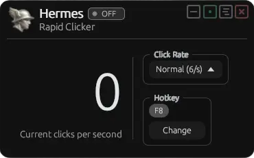
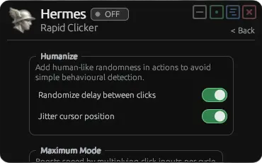

<div align="center">

<br>
<strong>- HERMES -</strong><br>
<sub>"Portable Windows clicker with</sub><br>
<sup>minimal design, built with Rust."</sup><br>
<a href="https://github.com/HenryNugraha/Hermes/tags"></a> <a href="https://github.com/HenryNugraha/Hermes/releases"></a><br>
</div>
<br>

Hermes is a lightweight Windows rapid clicker built with Rust and egui. It focuses on quick global-hotkey toggling, simple click-rate control, and a compact always-available window for checking the current click rate.

<p align="center">
  
  &nbsp;
  
</p>

## Features

- Global hotkey toggle, set to `F8` by default (customizable).
- Click-rate presets: Slow, Normal, Fast, Rapid, Turbo, Extreme, and even Maximum for unthrottled clicks.
- Live current clicks-per-second counter display.
- Optional pinned window mode so Hermes stays on top.
- Compact borderless window with persistence position.
- Automatic pause when the cursor is over the Hermes window, so the app does not click its own controls.
- Optional humanized random delay between clicks.
- Optional cursor jitter for small human-like cursor movement.
- Portable app with settings saved beside the executable.
- Built with Rust for native performance and memory safety.

## Download & Install

Download the executable program from [GitHub Releases page](https://github.com/HenryNugraha/Hermes/releases/latest), then run it.

Hermes does not need an installer. Its settings are stored beside the executable as `hermes.ini`, so placing the app in a writable folder is recommended.

## First Run

Launch Hermes, choose a click rate, then press the configured hotkey to toggle clicking on or off. The default hotkey is `F8`.

Use the settings button in the title bar to adjust humanization and Maximum mode options. Use the hotkey panel on the main view to change the toggle key.

## Click Rates

- `Slow`: 1 click per second.
- `Normal`: 6 clicks per second.
- `Fast`: 15 clicks per second.
- `Rapid`: 30 clicks per second.
- `Turbo`: 60 clicks per second.
- `Extreme`: 120 clicks per second.
- `Maximum`: sends clicks as fast as the worker loop can issue them, with an optional burst multiplier. Most of the time this will freeze the receiving application though...

Actual click speed depends on Windows input handling, system load, target application behavior, and the selected mode.

## Building From Source

Requirements:

- Windows
- Rust toolchain with edition 2024 support

Build a release executable:

```powershell
cargo build --release
```

Run from source:

```powershell
cargo run
```

Run checks:

```powershell
cargo check
```

## FAQ

### Is Hermes Windows-only?
• Yes. The app uses Windows APIs for global hotkeys, cursor position, window focus, refresh-rate lookup, and mouse input.

### Does Hermes click the right mouse button?
• No. Hermes sends left-click input.

### What is the default hotkey?
• The default toggle hotkey is `F8`. You can change it freely.

### What does Maximum mode do?
• Maximum mode removes the normal fixed click-rate pacing and sends click input as quickly as the worker loop can with additional controllable burst of inputs sent per cycle. This mode is experimental as in most cases, the receiving applications will freeze up due to the flood.

### What do the humanize options do?
• `Randomize delay between clicks` adds small timing variation around the selected click rate.

• `Jitter cursor position` moves the cursor slightly around its recent position while clicking. If you manually move the cursor, Hermes pauses jitter briefly so it does not fight your movement.
